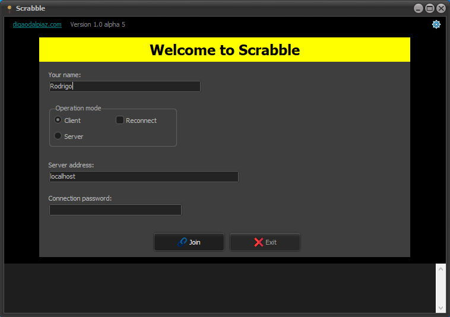
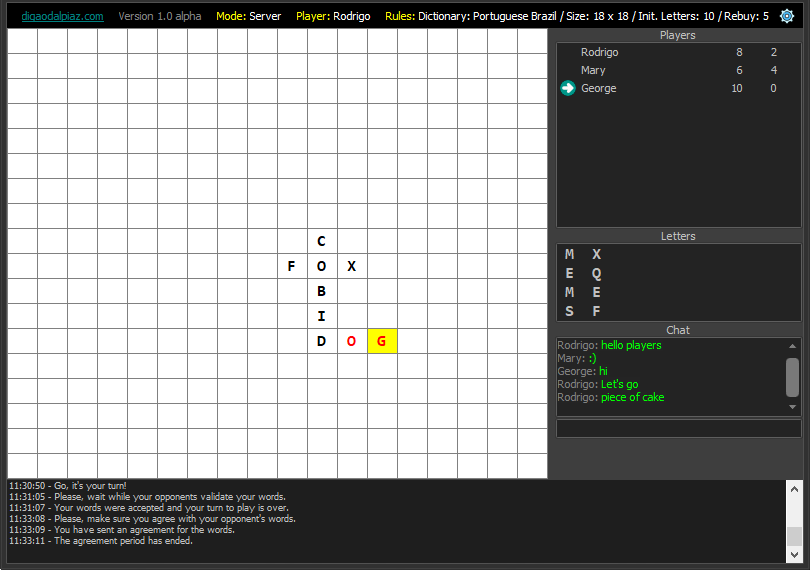
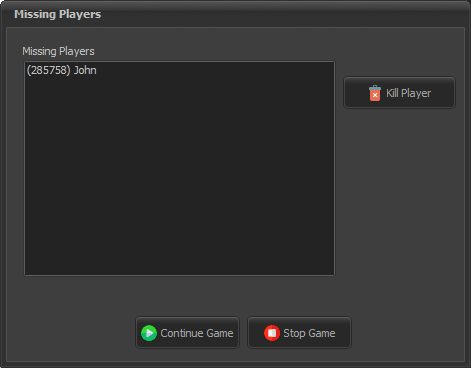
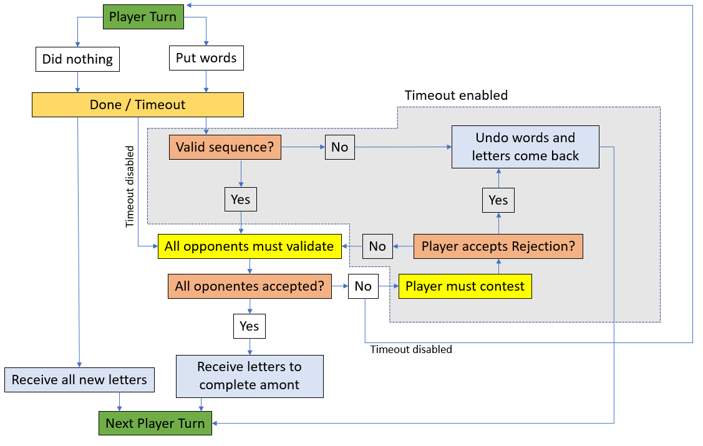

# Crosswords

## Delphi Client/Server Crosswords Game using Socket communication

[Download alpha version](https://github.com/digao-dalpiaz/Crosswords/releases)

### Demo Screens

**Attention! This game is under development, still in alpha version.**

### Why this game?

The objective of developing this game is actually the study of the controls performed in the client / server communication.
In addition to the connection between all the players, the treatment for failures was developed, which I consider the most important part.

Let's assume there are several players connected playing, and then one of them loses the connection, due to technical problems.
The game depends on all players being present to proceed with the moves. In this way, a treatment was implemented in which the game is stopped, allowing the server to decide what it wants to do:

1. Eliminate the player who lost the connection.
2. Wait for the player to re-establish the connection.
3. Stop the game permanently.

Some well-known and reputable games use the voting technique, where all the remaining players decide together what will be done. Here this decision is made only by the server, to make the process easier.

### How to play

You can play with as many opponents as you like.
Choose one to be the server, and the rest will be the clients that will connect to the server.
On the server, remember to allow incoming connections to the Windows firewall (usually the first time the game is opened in server mode, Windows itself will ask if you want to open the game port for external access).
The server can define the rules of the game, while waiting for all players to connect.

> Remember to set the correct dictionary in Game Rules (this is not the game language, but the dictionary to get random letters).

When all players are connected, the server can start the game.
You can chat to all players at any time using side panel.

Each player has his turn, in sequential order, indicated on the side panel.
All players will initially receive the same amount of letters.
The idea is to build words, using as many letters as possible.
The game ends when a player reaches the score defined in the rules (goal letters).
Each time you complete your move, all other players must accept the words you entered. If any player does not accept, your move will be disregarded. You can use chat to argue.

At the end of each move, your letters will always be completed to maintain the same amount. If you don't use any letters in a move, all your letters will be exchanged.

**A move can only be completed when all words entered are valid.**
*Players must define with each other before starting the game what kind of words will be accepted. Normally, only words in the dictionary are accepted.*

### Player turn logic diagram

### Supported languages

- English
- Portuguese Brazil

> There is a folder containing translation files (.lang). You can send me a new language translation if you like.

### Supported letters dictionaries

For now, the game supports letters in:
- English
- Portuguese Brazil

*For each language, there is a dictionary resource file, which basically indicates all the letters of the alphabet supported and how many times each occurs.*

> There is a folder containing dictionary files (.dic). You can send me a dictionary in the desired language.

### Required components:

- Dam: https://github.com/digao-dalpiaz/Dam

- DzSocket: https://github.com/digao-dalpiaz/DzSocket

> I'm developing in Delphi 10.3.3 Community Edition. I still don't know to specify in which previous versions it is possible to compile.

**You are welcome to submit bugs and suggestions, as well as become a tester. Please, do not hesitate to open as many issues as you like. If you want to test the game, please contact me via email on my GitHub profile.**

### Technical information

The server works on Port TCP 6631.

### To Do

- Get better sounds
- ~~Configurations screen (turn on/off sounds)~~
- ~~Review start screen center (is not considering title bar)~~
- ~~Make the score work~~
- ~~Review random letters logic~~
- ~~Include English dictionary~~
- ~~App translation to Portuguese Brazil and support any language translation~~
- ~~Review game rules~~
- ~~Behavior when user drop connection when the game is running~~
- ~~Password to connect~~
- ~~Allow server change settings while waiting players~~
- ~~Implement end of game~~
- ~~Logic to check if inserted letters is according with game rules~~
- ~~Better way to show that it's your turn~~
- ~~Zoom function in game grid~~
- ~~Time-out rule to a player turn~~
- ~~If language changed during game, the rules info in title bar remains in previous language~~
